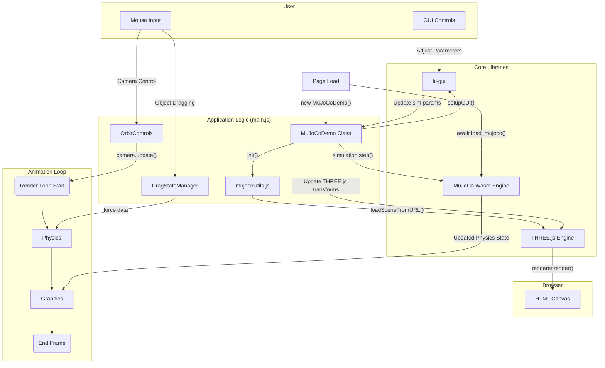

# System Diagram for examples/main.js

This diagram illustrates the architecture of the MuJoCo WASM example viewer.

### Diagram Explanation

This diagram shows:
1.  **Initialization**: How the main components (`MuJoCoDemo`, `MuJoCo Wasm`, `THREE.js`) are loaded and set up when the page loads.
2.  **User Interaction**: How mouse and GUI inputs are handled by `OrbitControls`, `DragStateManager`, and `lil-gui`, which in turn communicate with the main `MuJoCoDemo` class.
3.  **Render Loop**: The core animation loop that continuously runs, divided into a physics update step and a graphics update step.
    - The **Physics** step takes user input (like dragging forces), advances the `MuJoCo` simulation via `simulation.step()`, and produces a new physical state for all objects.
    - The **Graphics** step takes the new state from the physics simulation, updates the positions and rotations of the corresponding `THREE.js` objects, and finally renders the visual scene to the HTML canvas.
